# Phase B1D — Mobile Auth Gate Plan

Status: **DESIGN COMPLETE — IMPLEMENTATION BLOCKED ON HUMAN DECISIONS**

Scope: design and contract only; no authentication implementation, DB/config/migration change, Apple Developer operation, Supabase setting change, commit, or push.

## 1. Executive summary

The recommended production architecture is:

> **Native-owned Supabase PKCE email sign-in + verified Universal Link callback + Keychain-backed session + bearer-only mobile BFF.**

The existing Web application keeps its Supabase SSR cookie session. The locally bundled Capacitor application owns a separate mobile session, sends the Supabase access credential to `/api/mobile/*` with the Bearer scheme, and never uses Web cookies as its principal. Both sessions identify the same Supabase user, but their transport and storage boundaries do not mix.

The recommended sign-in UX combines two of the requested options:

- **Universal Link + authorization code / PKCE** is the callback and code-exchange security layer.
- **Magic link + Universal Link** is the current email-only credential UX.

The app starts PKCE locally, stores the pending verifier and attempt metadata in Keychain-backed storage, receives the one-time authorization response through an exact verified Universal Link, and exchanges it inside the app. It does **not** load the hosted callback into the same WKWebView and does **not** depend on a shared WebView cookie jar.

The first vertical slice is:

`local /login → email sign-in → secure session save → GET /api/mobile/scripts → local /scripts → force-quit/relaunch restore → logout`

No DB schema change is expected for this slice. The existing `listScripts()` service already re-fetches scripts by the verified owner. If implementation proves that a DB migration, a session denylist, or a DB-backed rate limiter is required, the implementation must stop and return to a separate decision gate.

Production Universal Links, Supabase redirect/email settings, a secure-storage implementation, the reviewer login method, and the device-revocation service level all require human decisions. Therefore this plan deliberately stops before implementation.

Primary references:

- [RFC 8252: OAuth 2.0 for Native Apps](https://www.rfc-editor.org/rfc/rfc8252.html)
- [Supabase PKCE flow](https://supabase.com/docs/guides/auth/sessions/pkce-flow)
- [Supabase native mobile deep linking](https://supabase.com/docs/guides/auth/native-mobile-deep-linking)
- [Apple Universal Links](https://developer.apple.com/documentation/xcode/allowing-apps-and-websites-to-link-to-your-content/)
- [Apple Keychain Services](https://developer.apple.com/documentation/security/keychain-services)

## 2. Confirmed facts / unknowns

### Confirmed facts

| Fact | Evidence / consequence |
|---|---|
| B1C is `PARTIAL — ARCHITECTURE VERIFIED` | Local Capacitor bundle, local shell, release guard, protected Preview BFF health, and CORS passed. Simulator-to-protected-Preview connected display was intentionally deferred. |
| The local app is a real local bundle | `local-spike` and `production` use `apps/mobile/dist`; they do not use `server.url`, cleartext, localhost navigation, or a remote hosted UI. |
| The mobile app has no auth implementation | It has only a public health client with `credentials: "omit"`; there is no Supabase client, router, secure storage, session restore, scripts route, or logout state. |
| Web auth is cookie-based Supabase SSR PKCE | `/api/auth/sign-in`, `/auth/callback`, middleware, route clients, and sign-out operate through browser cookies. |
| Current Web login is email magic-link only | There is no production password or in-app OTP UI. |
| The old native callback failed across browser contexts | The email link opened outside the initiating WebView, so the PKCE verifier cookie was absent and `callback_pkce_missing` was correctly observed. |
| Mobile health CORS is proven | Exact `capacitor://localhost`, no credentials, no `Set-Cookie`, and GET/OPTIONS behavior passed. |
| `/api/mobile/scripts` does not exist | Authenticated mobile CORS and Bearer validation are not implemented. |
| Existing script ownership is reusable | `listScripts(client, userId)` filters by `user_id` and returns the canonical server-owned script DTO. |
| Current Web sign-out scope is implicit | Supabase's default is global. After Web/mobile coexistence this could unintentionally revoke mobile refresh sessions, so normal Web logout must become explicitly local. |
| Current middleware is not mobile-bearer-safe | It bypasses cookie initialization only for public mobile health. All future `/api/mobile/*` paths must bypass cookie refresh and use route-level Bearer auth. |
| App Store submission toolchain is not reached | Native auth, reviewer access, signed physical-device Universal Links, and the broader submission gate remain incomplete. B1D does not claim Store readiness. |
| Developer checkout is out of scope | Its same-WebView auth smoke remains `PENDING`; no dirty change from that checkout is inspected, integrated, or modified. |

### Unknowns that block implementation

1. Which Keychain-backed Capacitor plugin or first-party bridge satisfies the storage contract.
2. The approved production and staging callback domains, bundle identifiers, Supabase projects, and BFF hosts.
3. Apple Associated Domains ownership, AASA delivery ownership, signing team readiness, and physical-device test availability.
4. Whether Supabase redirect allowlists, email templates, password sign-in, JWT lifetime, and session limits are approved for change.
5. Whether email-link prefetch needs an explicit confirmation interstitial or OTP recovery in v1.
6. The durable rate-limit provider and whether it can be used without a DB schema change.
7. Whether access-token validity until expiry is an acceptable lost-device revocation window.
8. Whether a dedicated reviewer password account is approved or Apple has pre-approved an equivalent full demo mode.

No environment value was opened to answer these questions. Names of configuration fields may be designed, but actual values must be supplied through the approved deployment process later.

## 3. Existing Web auth

### Current flow

1. `middleware.ts` guards `/scripts`, `/setup`, `/progress`, and `/settings`.
2. `/login` renders the email magic-link form.
3. `components/auth/login-form.tsx` posts the email to relative `/api/auth/sign-in` with same-origin credentials.
4. `app/api/auth/sign-in/route.ts` validates the email, builds a current-origin `/auth/callback`, starts Supabase email OTP/magic-link auth, and applies pending PKCE cookies plus the short-lived `nm-login-next` continuity cookie.
5. `app/auth/callback/route.ts` exchanges the code or verifies a token hash, applies the Web session cookies, clears transient state, and redirects to a sanitized internal path.
6. Web API routes use a cookie-backed Supabase client and `requireCurrentUser()`.
7. Web sign-out clears browser auth artifacts and currently calls Supabase sign-out without an explicit scope.

This is a valid same-browser Web design. It is not a valid local-bundle mobile design because the local origin cannot use relative hosted routes, does not share hosted cookies, and must survive app restarts without WebView cookie dependence.

### Boundaries to preserve

- Keep Web SSR/page auth cookie-based.
- Keep existing protected Web routes and `/api/scripts` behavior.
- Keep safe internal return-path normalization.
- Keep server-owned script data and explicit owner re-fetch.
- Do not copy Web cookies into mobile storage.
- Do not accept a mobile access credential on existing cookie-only Web routes unless a separate future contract explicitly allows it.

### Gaps to close later

- Mobile-safe machine reason codes do not exist.
- Existing sign-in/callback logs include more URL/cookie-name/provider detail than the mobile policy will permit.
- Existing sign-out can expose a raw provider message and uses implicit global scope.
- No authenticated mobile CORS layer exists.
- No Bearer Supabase client exists.
- No automated test covers native callback, refresh, expiry, restore, or mobile/Web session coexistence.

### Old auth smoke classification

The Developer checkout same-WebView smoke stays **PENDING**.

Still useful for the new architecture:

- Web magic-link regression behavior.
- Safe return-path and route-guard behavior.
- Email delivery and rate-limit baseline.
- The observed browser-context PKCE failure category.
- Whether Web and mobile sessions can coexist without accidental global logout.

No longer a completion criterion:

- Hosted `server.url` WebView cookie persistence.
- Forcing `/auth/callback` back into the initiating WebView.
- Proving the PKCE verifier cookie returns to the same cookie jar.
- localhost, cleartext, or broad `allowNavigation` behavior.
- A same-WebView workaround as the final auth architecture.

## 4. Mobile auth requirements

### Functional requirements

- A user starts on local `/login` and signs in without exposing a provider secret.
- A successful callback always returns to the local app, not a hosted Web UI.
- The app restores a valid session after force quit and relaunch.
- The app reads only the current user's scripts through `GET /api/mobile/scripts`.
- The local `/scripts` view supports non-empty, empty, loading, retryable offline, expired-session, and safe server-error states.
- Logout signs out the current mobile session, clears local secrets even when offline, and does not unexpectedly sign out the Web session.
- A separate explicit action can revoke all sessions for device-loss recovery.
- Account deletion remains reachable in the eventual mobile product and invalidates the mobile session when completed.
- A stable reviewer account can reach the same owned-data path without a backdoor.

### Security requirements

- The app is a public client and contains no client secret, service-role key, provider API key, bypass secret, or privileged DB credential.
- PKCE is mandatory for link/code callback flows.
- Production callback is an app-claimed HTTPS Universal Link with exact scheme, host, path, and environment checks.
- The Supabase full session envelope and pending PKCE transaction are stored only in Keychain-backed storage.
- Long-lived auth material is never placed in `localStorage`, `sessionStorage`, Preferences/UserDefaults, cookies, files, source, build metadata, traces, screenshots, or docs.
- Mobile BFF auth is Bearer-only, TLS-only, no-cookie, no-`Set-Cookie`, and `Cache-Control: no-store`.
- BFF derives the user from a validated credential and re-fetches owned records; it never trusts a client-supplied user ID.
- CORS is exact and environment-specific, but authorization never relies on Origin alone.
- Refresh is single-flight and rotated state is written atomically.
- Login, verification, refresh, and protected reads are rate-limited with non-enumerating errors.
- All externally visible auth errors use a stable safe reason code.

### Product and App Store requirements

- The authentication flow must work in a signed physical-device build; Simulator success alone is insufficient for Universal Links.
- Reviewer access must not depend on the reviewer controlling a mailbox, receiving a magic link, disabling MFA, or using an internal bypass.
- The app must keep the in-app account-deletion entry point when mobile settings are implemented.
- Adding a third-party/social provider is not part of this slice. If one is proposed, Apple login-service requirements and the provider architecture must be re-evaluated first.

## 5. Options comparison

### Security, UX, and platform boundary

| Option | App Store suitability | UX | Security | WKWebView dependency | Cookie dependency | Secure storage |
|---|---|---|---|---|---|---|
| 1. Universal Link + authorization code / PKCE | **High**. Claimed HTTPS is the preferred iOS native redirect pattern. | Medium-high; leaves app context briefly and returns directly. | **High** with PKCE, exact callback validation, one-time code, and binding to one pending transaction. | None for auth completion. For a future OAuth provider use the system/external auth session, not embedded WebView credential entry. | None for mobile session/BFF. | Required for verifier, pending attempt, and full session envelope. |
| 2. Custom URL scheme + PKCE | Acceptable as a development aid; not preferred as Store primary. | Good when dispatch succeeds. | Medium; another app may register the same scheme. PKCE limits code theft but does not prove domain ownership. | None. | None. | Same as option 1. |
| 3. In-app email OTP | Generally acceptable. | Medium; user copies/types a short code and remains in app. | Medium-high with short TTL, attempt limits, generic errors, and email security; more online-guessing surface than a link. | None. | None. | Required after verification for the full session envelope; no callback verifier needed. |
| 4. Magic link + Universal Link | **High** if the link returns to the signed app and fallback is safe. | High when one tap succeeds; email-app switch and link scanners can cause failures. | High when implemented as native-owned PKCE; one-time links require prefetch mitigation. | None in the recommended version. The old same-WebView handoff is rejected. | None for mobile session/BFF. | Same as option 1. |
| 5. Web session + mobile session coexistence | **Required architecture policy**, not a credential UX. | Users can remain signed in independently on Web and mobile. | High only when cookie and Bearer principals are never mixed. | Web may use browser context; mobile does not depend on it. | Web only. Mobile never uses it. | Mobile only. |
| 6. Staged combination | High if production closes on Universal Links, not the fallback. | Allows controlled rollout and recovery. | High if every path produces the same session contract and weaker paths are environment-scoped. | None for production mobile. | Web only. | Required for every mobile session path. |

### Supabase/BFF compatibility and operations

| Option | Supabase compatibility | BFF compatibility | Reviewer account | Refresh / expiry / logout | Web impact | Effort | Rollback |
|---|---|---|---|---|---|---|---|
| 1. Universal Link + PKCE | Strong: PKCE, custom storage, code exchange, refresh, and mobile deep links are supported. | Excellent with Bearer validation. | Credential UX still needs a reviewer decision. | Native refresh/session manager required; explicit local/global logout scopes. | Low when kept in a separate mobile client. | 4–7 days for auth core; more with BFF/reviewer/release gates. | Medium because entitlement, AASA, redirect allowlist, and shipped app must remain compatible. |
| 2. Custom scheme + PKCE | Strong if the exact redirect is allowlisted. | Excellent. | Does not solve mailbox-dependent reviewer access. | Same as option 1. | Low. | 3–5 days. | Easy-medium, but old builds may still register the scheme. |
| 3. In-app email OTP | Strong API support, but magic link and OTP share project-level email-template behavior. | Excellent after session creation. | Poor by itself because reviewers should not depend on dynamic mailbox access. | Same stored session after verify; code resend/attempt handling added. | Potentially high: changing the shared template can alter Web magic links. | 2–4 days for OTP core; more for safe coexistence. | Medium because template rollback affects both clients. |
| 4. Magic link + Universal Link | Strong and closest to current email-only identity model. | Excellent after app-side exchange. | Still needs a password/demo path. | Same as option 1; link expiry/prefetch recovery added. | Low if the Web template and Web callback remain compatible. | 4–7 days for auth core. | Medium. |
| 5. Web cookie + mobile Bearer coexistence | Same user identity, separate clients. | **Recommended**: Web routes cookie-only, `/api/mobile/*` Bearer-only. | Reviewer uses mobile's normal credential path. | Normal logout must be local; explicit all-device action is global. | Small but requires explicit Web logout-scope regression. | 1–2 days beyond auth core. | Easy because Web remains intact. |
| 6. Staged combination | Supported if redirects/templates are intentionally separated. | Same Bearer contract for all mobile entries. | Password reviewer can be added without changing product-data authorization. | One session manager for every entry path. | Medium unless email templates are isolated. | 1–3 days beyond primary path. | Medium; path flags and external config must be retired carefully. |

### Decision

Adopt the following staged composition:

1. **Production primary:** option 4 implemented with option 1's native-owned PKCE contract.
2. **Session architecture:** option 5, with strict cookie/Bearer separation.
3. **Development callback fallback:** option 2 only if explicitly approved and only for Simulator/development. It is not a Store release gate substitute.
4. **Recovery candidate:** option 3 only after the shared Supabase email-template and Web regression impact are approved.
5. **Future social OAuth:** not selected. Provider selection would reopen this architecture and Apple login-service analysis.

RFC 8252 recommends an external user-agent for native OAuth, requires PKCE for public native clients, and prefers app-claimed HTTPS redirects over private-use schemes where available. Supabase documents that its PKCE verifier is stored on the initiating device and that the code exchange must occur on that same device. Supabase also documents that automated email-link prefetch can consume one-time links; a user-confirmation step or OTP is the recovery design, not a silent retry.

## 6. Recommended architecture

### Trust boundaries

| Component | Owns | Must not own |
|---|---|---|
| Local mobile app | PKCE transaction, mobile session state, Keychain adapter, auth UI, exact callback handling, Bearer attachment | Service-role key, provider key, canonical scripts, authorization decisions |
| Supabase Auth | Identity verification, one-time code exchange, access/refresh issuance, refresh rotation, session revocation | Product-data response shaping |
| HTTPS BFF | Mobile credential validation, CORS, safe error mapping, ownership re-fetch, rate policy, product contract | Mobile refresh-token persistence |
| Supabase DB/RLS | Persistent owned data and row policy | Client-supplied identity trust |
| Existing Web app | Cookie session, SSR route guards, Web magic-link flow | Mobile Keychain session or mobile Bearer principal |

### Architectural rules

- The mobile app may embed only the environment's public Supabase URL and public/publishable key. They are public client configuration, not authority.
- Mobile talks directly to Supabase Auth only for sign-in, exchange, refresh, and sign-out.
- Mobile product data always goes through the HTTPS BFF.
- `/api/mobile/*` bypasses middleware's cookie refresh and authenticates at the route boundary.
- The BFF validates the access credential with the configured Supabase project, creates a user-scoped/RLS client using that same credential, and passes only the verified user ID to existing services.
- Service-role clients are prohibited for ordinary mobile reads.
- The mobile app never sends a user ID as authorization evidence.
- Existing Web auth routes stay cookie-only. Shared business services may be reused below the auth adapter.
- A feature or deployment rollback must never fall back to hosted same-WebView auth.

## 7. Authentication sequence

```mermaid
sequenceDiagram
    actor User
    participant App as "Local mobile app"
    participant Keychain as "Keychain-backed store"
    participant Auth as "Supabase Auth"
    participant iOS as "iOS Universal Link dispatch"
    participant BFF as "HTTPS mobile BFF"
    participant DB as "Supabase DB / RLS"

    User->>App: Enter email on local /login
    App->>Keychain: Save pending PKCE verifier + attempt metadata
    App->>Auth: Start email sign-in with PKCE challenge and exact callback
    Auth-->>User: Deliver one-time sign-in email
    User->>iOS: Open sign-in link
    iOS->>App: Open verified HTTPS callback
    App->>App: Validate scheme, host, path, and pending attempt
    App->>Keychain: Read matching pending transaction
    App->>Auth: Exchange one-time code with verifier
    Auth-->>App: Return mobile session
    App->>Keychain: Atomically save full session; delete pending transaction
    App->>BFF: GET /api/mobile/scripts with Bearer scheme
    BFF->>Auth: Validate access credential and obtain authentic user
    BFF->>DB: Re-fetch owned scripts with user-scoped client
    DB-->>BFF: Owned scripts only
    BFF-->>App: Safe no-store response
    App-->>User: Render local /scripts
```

### Callback acceptance contract

- Register both warm-open (`appUrlOpen`) and cold-start (`getLaunchUrl`) handling through the Capacitor App API.
- Accept HTTPS only in staging/production.
- Compare the full configured host and exact callback path; reject subdomains, suffix matches, alternate ports, user-info, fragments, and duplicate authorization parameters.
- Require exactly one unexpired pending PKCE transaction created by this app installation. The verifier is the mandatory binding for the current Supabase email flow.
- A separate high-entropy callback nonce may be matched only if the chosen Supabase redirect transport is proven to preserve it. Supabase email `signInWithOtp` does not expose an OAuth `state` option, so `state` is not a release assumption.
- Bind the pending record to environment and app-install namespace.
- Process only one callback at a time. Repeated delivery of the same callback is a safe no-op/error and cannot produce a second session.
- Never trust a callback-supplied `next`. This vertical slice always continues to local `/scripts` after success.
- Never navigate the WebView to the callback URL and never log or persist the full callback URL/query.
- Delete the pending verifier/attempt on success, explicit cancellation, or expiry. Once code exchange starts, any non-success—including an indeterminate network failure—requires a fresh login attempt; never retry the same code/verifier automatically.

The provider's authorization code is short-lived and one-time; the app must restart sign-in instead of trying to recover or replay an invalid exchange.

## 8. Session storage

### Storage decision

Use a **Keychain-backed secure-storage adapter** with these non-negotiable capabilities:

- iOS accessibility equivalent to `WhenUnlockedThisDeviceOnly`.
- No iCloud/Keychain synchronization, backup migration, shared WebView access, or cross-app access group.
- Atomic replace and delete semantics.
- Namespaces separated by app identifier, environment, auth contract version, and install generation.
- No value logging in native or JavaScript errors.
- A deterministic `secure_storage_unavailable` failure; no silent fallback to weaker storage.

The exact plugin/bridge is a human stop decision. Capacitor Preferences uses iOS UserDefaults and is **not** acceptable for auth secrets. An in-memory adapter is allowed only in unit tests.

### Persistent and transient material

| Material | Location | Lifetime / deletion |
|---|---|---|
| Supabase full session envelope | Keychain-backed store; active session is mirrored in memory while the app runs | Contains the SDK session fields required for supported exchange/refresh persistence. Atomically replaced after exchange/refresh; removed on logout, invalid refresh, account deletion completion, environment mismatch, or reinstall detection. |
| Access credential | Inside the Keychain session envelope and in process memory while active | Used only over TLS with Supabase Auth or the BFF; replaced on refresh and removed on logout/purge. |
| Non-secret environment / contract metadata | Keychain item attributes or a separate non-secret marker | Never used as proof of identity. |
| PKCE verifier | Separate Keychain pending-transaction item | One sign-in attempt; removed on success/cancel/expiry. |
| Attempt ID / optional callback nonce | Same pending transaction | One sign-in attempt; no URL or code is retained. A nonce is enforced only after transport preservation is proven. |
| Install marker | Non-secret app preferences | Used only to detect reinstall and clear a surviving Keychain auth namespace. It contains no credential. |
| Last screen and harmless UI state | App preferences if needed | Must never include auth response data, email, callback URL, or script content. |

### Supabase client behavior

- One mobile Auth client instance per process and environment.
- `flowType: "pkce"`.
- `detectSessionInUrl: false`; the app parses and validates the Universal Link itself.
- `persistSession: true` with the Keychain-backed Supabase storage adapter. This is the supported SDK contract and persists the full session envelope, not a filtered refresh-only subset.
- `autoRefreshToken: false`; the app lifecycle coordinator owns foreground refresh and single-flight serialization.
- App-controlled refresh; concurrent refreshes are serialized.
- The same secure adapter stores the PKCE verifier and the SDK session. It never falls back to browser storage.
- A cold start reads the Keychain session candidate and refreshes/validates it before treating the user as authenticated or rendering owned data.

If the selected SDK/plugin combination cannot persist the standard full session envelope and PKCE verifier in Keychain-backed storage, implementation must stop. A special adapter that filters SDK keys or a hand-written raw Auth protocol is not approved by this plan; localStorage or Preferences is never the fallback.

## 9. BFF credential contract

### Endpoint

`GET /api/mobile/scripts`

Required request properties:

- HTTPS BFF origin selected by the build profile.
- Bearer authorization scheme containing the current Supabase access credential.
- Exact allowed `Origin`.
- `Accept: application/json`.
- `credentials: "omit"` and `cache: "no-store"` in the mobile fetch client.
- No credential in query, body, URL fragment, custom loggable header, or cookie.

The Authorization parser accepts exactly one Bearer value, applies a conservative size limit, and rejects missing, duplicated, malformed, or alternate schemes before touching product services.

### BFF verification

1. Validate the request Origin and method.
2. Parse the Bearer credential without logging it.
3. Ask the configured Supabase Auth project for the authentic user (`getUser(jwt)` is the initial correctness-first choice).
4. Create a Supabase data client carrying the same user credential, with session persistence/refresh disabled.
5. Call the existing `listScripts(client, verifiedUser.id)`.
6. Rely on both explicit `user_id` filtering and RLS; never service role.
7. Map the existing service DTO into the mobile contract and return no-store headers.

`getUser(jwt)` performs a network validation and returns an authentic user suitable for authorization. A later move to local JWKS/claims verification is allowed only if issuer, audience, signature, expiry, key rotation, and revocation semantics are documented and tested; it is not an optimization for the minimum slice.

### Success body

```json
{
  "ok": true,
  "data": {
    "scripts": [
      {
        "id": "opaque-script-id",
        "title": "string",
        "content": "string",
        "targetSeconds": 60,
        "locale": "en-US",
        "createdAt": "ISO-8601",
        "updatedAt": "ISO-8601"
      }
    ]
  }
}
```

The list is sorted by existing service semantics (`updated_at` descending). An empty owned list is `200` with `scripts: []`, not `404`.

### Error body and status contract

```json
{
  "ok": false,
  "error": {
    "reasonCode": "session_expired",
    "message": "ログインし直してください。",
    "retryable": false
  }
}
```

| HTTP | `reasonCode` | Client action |
|---|---|---|
| 400 | `request_invalid` | Do not retry automatically. |
| 401 | `auth_required` | No session candidate; go to login. |
| 401 | `session_expired` | Refresh once, retry this GET once, then login. |
| 401 | `session_invalid` | Clear local session and go to login. |
| 403 | `origin_forbidden` | Fail closed; environment/config error. |
| 403 | `account_deletion_in_progress` | Stop product reads; allow status/logout only in the future deletion slice. |
| 405 | `method_not_allowed` | Client contract defect. |
| 429 | `rate_limited` | Respect `Retry-After`; no tight loop. |
| 500 | `scripts_unavailable` | Safe retry UI; no provider/DB detail. |
| 503 | `auth_unavailable` | Preserve local session candidate; retry later. |
| 503 | `mobile_auth_disabled` | Maintenance UI; do not fall back to WebView auth. |

All responses, including errors, use `Cache-Control: private, no-store`, `Vary: Origin`, and `X-Content-Type-Options: nosniff`. They never set a cookie and never include `Access-Control-Allow-Credentials`.

- Every `401` also returns the safe challenge `WWW-Authenticate: Bearer` without provider detail.
- `429` returns a bounded `Retry-After` value.
- Cross-origin clients may read only `Retry-After` and `WWW-Authenticate` through `Access-Control-Expose-Headers`; no credential-bearing header is exposed.

## 10. CORS / CSRF boundary

### Web boundary

- Web pages and Web API routes remain same-origin and cookie-authenticated.
- Their CSRF posture continues to depend on same-origin requests, SameSite cookies, safe method choice, and any future explicit origin/CSRF checks.
- Mobile Bearer support is not added to Web endpoints.

### Mobile boundary

- Production allowed Origin is the exact Capacitor local origin already proven in B1C.
- Local Vite development Origin is allowed only by an explicitly non-production BFF environment.
- Production does not accept wildcard, `null`, origin suffixes, arbitrary Vercel/Preview origins, or localhost development origins.
- OPTIONS is unauthenticated and returns `204` only for exact Origin, requested method `GET`, and requested headers that are a case-insensitive subset of the allowlist. A browser commonly asks for only `authorization`; it is not required to send the whole allowlist.
- Allowed methods: `GET, OPTIONS` for this slice.
- Allowed request headers: `Authorization, Accept, Content-Type`.
- Exposed response headers: `Retry-After, WWW-Authenticate` only.
- Actual responses vary on `Origin`; preflight responses vary on `Origin`, `Access-Control-Request-Method`, and `Access-Control-Request-Headers` so caches cannot reuse a broader decision.
- No `Access-Control-Allow-Credentials` because cookies are not part of the mobile contract.
- Cookie-only requests receive `401`; if a cookie is present alongside a valid Bearer credential, it is ignored and never contributes to the principal.
- Middleware skips cookie session initialization for the entire `/api/mobile/*` namespace. Each route owns its Bearer guard.

Classical cookie CSRF does not apply to the Bearer-only mobile route because the browser does not attach its credential ambiently and mobile fetch uses `credentials: "omit"`. The Universal Link return is protected as a cross-app request by PKCE, exact callback validation, and the one pending transaction. An additional nonce is defense in depth only after transport support is proven.

CORS is defense in depth, not authentication: a non-browser client can forge Origin. Valid credential verification, short expiry, ownership filtering, and RLS remain the authorization boundary.

## 11. Refresh / expiry / logout

### Refresh and session restoration

- On cold start, enter `booting`, read the Keychain session envelope, and refresh/validate it before rendering owned data.
- Refresh when the app returns to foreground and the access expiry is within a 60-second skew.
- Serialize refresh through one mutex/promise; callers await the same result.
- Atomically replace the rotated full session envelope before publishing the new access credential to other requests.
- On an expired `GET /api/mobile/scripts`, refresh once and retry that GET once.
- Never automatically retry a future mutation unless it has a documented idempotency key.
- Network failure preserves the Keychain candidate and shows an offline/retry state.
- Provider-confirmed invalid, reused, or revoked refresh clears memory and Keychain and returns to `/login`.
- Corrupt or environment-mismatched stored state is deleted without sending it to the wrong environment.

### Logout

Normal mobile logout:

1. Stop new API work and cancel pending auth transaction state.
2. Attempt Supabase sign-out with **local scope** and a bounded timeout.
3. Regardless of remote result, delete memory and Keychain auth material.
4. Render local `/login` and ensure relaunch stays signed out.
5. If remote revocation was not confirmed, expose only `logout_remote_unconfirmed`; do not restore the deleted session.

Normal Web logout must also become explicitly local during implementation so it does not revoke mobile sessions. A separate, clearly labelled "sign out all devices" action uses global scope.

Supabase documents that an already issued access JWT can remain valid until expiry even after refresh sessions are revoked. Therefore:

- Device-loss recovery uses global revoke from another trusted Web/mobile session.
- The production access-token lifetime must be short enough for the accepted residual window.
- If immediate per-device invalidation is mandatory, a live `session_id` check or denylist is required. That may need a DB/external store and is a **stop condition**, not an implicit extension of this slice.

### Account deletion relationship

- The eventual mobile deletion request must use the same Bearer identity and existing server-owned deletion service; it must not accept a user ID from the client.
- A destructive confirmation requires recent re-authentication and its own vertical slice.
- While a deletion request is processing, product-data routes should return `account_deletion_in_progress`; status and logout remain available.
- Successful auth-user deletion makes future refresh/validation fail. The app then clears Keychain state.
- Remote deletion cannot physically erase a secret from an offline lost device, but global revoke plus expiry makes it unusable; the next app validation clears it.
- Reviewer accounts are excluded from deletion tests and are managed through a separate operational lifecycle.
- No account-deletion schema change is included in B1D.

## 12. Universal Links impact

Universal Links are **required for the production primary path**.

External prerequisites, all deferred:

- Apple App ID and Associated Domains capability.
- Signed entitlement containing only the approved environment domain.
- A valid AASA document served over HTTPS without redirect and scoped narrowly to the mobile auth callback path.
- Exact Supabase redirect allowlist entries per environment.
- A callback/fallback page that never renders, logs, or persists authorization parameters.
- Physical-device verification for installed, backgrounded, terminated, and not-installed cases.

Repo-side implementation candidates after approval:

- Static AASA route/asset.
- iOS entitlement and Xcode project wiring.
- Capacitor App dependency and cold/warm URL-open handling.
- Capacitor iOS-compatible `continue userActivity` forwarding if the generated integration does not already provide it.
- Safe web fallback for a callback received when the app is not installed.

Rules:

- The callback path is exact and narrow; it is not an arbitrary in-app navigation bridge.
- Preview domains and Deployment Protection bypass material are never embedded.
- Custom schemes are excluded from the first Store-facing build unless a human explicitly approves a development-only fallback.
- A custom scheme fallback uses an environment-specific reverse-domain scheme and the same PKCE/pending-transaction validation. Simulator success cannot replace Universal Link physical-device success.
- AASA and redirect entries must remain compatible with supported old builds during rollback/sunset.
- Email-link prefetch must be tested. If it occurs, use an explicit user-confirmation interstitial or approved in-app OTP recovery; do not silently weaken one-time semantics.

Official references: [Apple supporting associated domains](https://developer.apple.com/documentation/xcode/supporting-associated-domains), [Capacitor App URL events](https://capacitorjs.com/docs/apis/app), and [Supabase email-template prefetch limitations](https://supabase.com/docs/guides/auth/auth-email-templates).

## 13. Reviewer account

### Recommended policy

Create one dedicated **production email/password reviewer account** using the same Supabase identity, mobile session manager, Bearer BFF, RLS, and ownership rules as an ordinary user.

- No reviewer bypass, master code, static OTP, privileged role, hardcoded allowlist, or demo-only data API.
- The login screen may expose a normal password sign-in path only after the product/human decision approves it. It must not call the E2E-only test-login route.
- Credentials are stored only in App Store Connect Review Information and an approved operational secret store.
- Docs, source, environment files, screenshots, traces, issue comments, and logs contain only a safe reviewer alias, never credentials.
- The reviewer account owns a small stable set of safe scripts and has the minimum provider quota required for the reviewed flow.
- It is tested immediately before submission, kept active for the review window, monitored without identifying logs, rotated after review, and globally revoked when retired.
- It is not used for destructive account-deletion testing.
- Dynamic email access, magic links, OTP, MFA, VPN, employee SSO, or manual operator intervention are not prerequisites for review.

Apple states that apps requiring sign-in should provide a valid demo account and instructions in App Review Information. If password sign-in is not approved, the alternative is an Apple-preapproved fully featured demo mode; inventing a secret bypass is not acceptable. See [Apple App Review guidance](https://developer.apple.com/app-store/review/).

This reviewer path requires confirmation that Supabase password sign-in is allowed and that adding it does not materially change the public auth product. That is a stop condition.

## 14. Logging / artifact safety

### Allowed structured fields

- Event name from a fixed allowlist.
- Safe reason code.
- HTTP status.
- Opaque request ID generated by the BFF.
- Environment label (`staging` or `production`).
- App version/build number.
- Origin-match boolean, never the raw Origin on auth errors.
- Latency bucket and retry count.
- Boolean flags such as `has_session_candidate`, never the candidate itself.

### Forbidden in logs, analytics, errors, traces, screenshots, and artifacts

- Email address or normalized email hash that can be reversed or correlated externally.
- Raw IP address or user/account ID.
- Authorization header or any access/refresh credential.
- Authorization code, token hash, OTP, PKCE verifier/challenge, callback state, or pending transaction payload.
- Full callback, redirect, confirmation, or magic-link URL; all query strings are forbidden.
- Cookie name/value and session object.
- Raw Supabase/provider message, response body, request body, or SDK debug dump.
- Script content, provider identifiers, storage paths, signed URLs, or service-role material.
- Keychain keys if their names reveal an account identifier.

### Enforcement

- Map provider errors to safe internal reason codes at one boundary.
- Release builds disable auth SDK debug logging and URL-console logging.
- Request logging redacts Authorization and strips callback query strings before application logs.
- Edge/CDN/platform access logging for the callback path must also omit or irreversibly redact the query. Application-level redaction alone is insufficient because a not-installed/AASA-failure callback can reach the platform before app code runs.
- The callback fallback uses `Referrer-Policy: no-referrer`, no analytics/pixels/third-party scripts, no query rendering, and no-store/CSP headers. If the hosting platform cannot prevent callback-query retention, implementation stops and selects an explicit confirmation interstitial or approved OTP recovery.
- Automated tests inject sentinel secret-like values and assert they never appear in UI, logs, snapshots, traces, build output, or tracked files.
- Continue `npm run check:auth-artifacts`; extend it for mobile auth artifacts before release.
- Never attach an authenticated network capture or callback URL to a ticket. Reproduce with synthetic values and safe status/reason only.

### Stable mobile reason codes

All mobile auth/UI/API errors use one canonical public enum. The API table in section 9 is a status mapping over this same set; it does not define a second vocabulary.

Auth/session lifecycle:

- `auth_required`
- `session_expired`
- `session_invalid`
- `callback_invalid`
- `pkce_failed`
- `auth_restart_required`
- `auth_unavailable`
- `secure_storage_unavailable`
- `environment_mismatch`
- `logout_remote_unconfirmed`

Request/product boundary:

- `request_invalid`
- `origin_forbidden`
- `method_not_allowed`
- `rate_limited`
- `scripts_unavailable`
- `account_deletion_in_progress`
- `mobile_auth_disabled`

Account existence, exact provider rejection, token-validation detail, and whether an email has a password identity are never exposed.

## 15. Threat model

| Threat | Control | Residual / release decision |
|---|---|---|
| Authorization-code interception | PKCE, one-time short-lived code, verified Universal Link, exact callback, one pending transaction, single-flight exchange | A compromised device remains out of scope. |
| Custom-scheme hijack | Universal Link primary; custom scheme development-only; PKCE even in fallback | Do not accept scheme-only Store release. |
| Callback injection / cross-app request forgery | PKCE verifier bound to one pending attempt, exact environment/host/path, duplicate-parameter rejection; optional nonce only after transport proof | Current email flow has no OAuth `state` option; PKCE is the mandatory binding. |
| Same-WebView cookie confusion | Mobile never uses Web cookie principal; `/api/mobile/*` middleware cookie bypass | Web and mobile logout scope must be tested together. |
| Refresh credential theft | Keychain ThisDeviceOnly, no Web storage, no backup/sync, minimal lifetime, logout/revoke | Jailbroken/compromised device is residual risk. |
| Access/session theft through XSS | Keychain protects at rest; short access expiry, CSP/dependency hygiene, minimal bridge surface, no HTML injection, no logs | A live XSS may invoke the bridge or use the in-memory session; security review is required. |
| CSRF | No ambient mobile cookie, Bearer only, credentials omitted; PKCE/pending transaction on callback | CORS does not replace auth. |
| CORS spoofing | Exact allowlist plus real credential validation and RLS | Native/non-browser clients can spoof Origin; expected. |
| Cross-user data exposure | Auth server validation, user-scoped Supabase client, explicit `user_id` filter, RLS, negative tests | Service-role use would invalidate the gate. |
| Refresh replay/race | Rotation, mutex, atomic replace, one retry | SDK/provider reuse-window behavior must be verified. |
| Lost device | Global revoke from another device, short access expiry, local Keychain protection | Immediate revoke may require live session checking and a new store. |
| Email link scanner | Explicit confirmation interstitial or OTP recovery after approved template design; safe expired-link UX | Must be tested against production email delivery. |
| OTP/password brute force | Supabase limits, client cooldown, generic responses, WAF/durable limiter | Rate provider and thresholds require approval. |
| Account enumeration | Same outward response for unknown/existing identities; no raw provider errors | Operational metrics must remain aggregate. |
| Environment mix-up | Separate Supabase project, BFF host, callback domain, Keychain namespace, issuer/audience, bundle/build profile | Current staging topology is not yet approved. |
| Reviewer credential abuse | Least-privilege owned data, App Store Connect-only delivery, monitoring, rotation/global revoke | Reviewer password remains a production credential. |
| Auth artifact leakage | Redaction tests, release logging off, artifact scanner, no callback screenshots | Human evidence collection remains a process risk. |
| Secure-storage plugin compromise | Dependency review, minimal bridge surface, pinned version, native tests, no weak fallback | Plugin selection is a human stop decision. |

### Rate-limit design

- Mobile UI applies a resend cooldown and respects provider `Retry-After`/429 behavior.
- Supabase Auth remains the primary limiter for email send, password verification, code verification, and refresh.
- BFF applies a durable pre-auth source limit before expensive validation and an authenticated user limit after validation.
- Pre-auth limiter keys use a server-side one-way/HMAC derivation of source data and are never emitted to logs or responses.
- Initial engineering target for scripts reads: burst 10 per 10 seconds and sustained 60 per minute per verified user; pre-auth traffic receives a separate conservative source limit.
- A 429 returns only `rate_limited`, retryability, and `Retry-After`.
- Do not use an instance-local Map in serverless production.
- If the approved durable limiter requires DB schema changes, stop. Select an approved edge/WAF/KV provider or create a separate migration decision.

Supabase's current limits and defaults must be read from approved configuration during implementation, not assumed from this document. See [Supabase Auth rate limits](https://supabase.com/docs/guides/auth/rate-limits).

### Staging / production separation

| Boundary | Staging | Production |
|---|---|---|
| BFF | Dedicated reachable staging host with app-level auth; no Preview bypass secret in bundle | Canonical production HTTPS host |
| Supabase | Separate project/issuer/public key/session namespace | Production project only |
| Callback | Staging-only verified domain and AASA entry | Production-only verified domain and AASA entry |
| App identity | Separate bundle/build profile where practical | Store bundle identifier |
| Keychain | Environment + app ID + contract version namespace | Separate namespace; no cross-read |
| Rate limits / reviewer | Test accounts and staging limits | Dedicated production reviewer and production limits |

Staging credentials must fail against production BFF, and production credentials must fail against staging. Deployment Protection remains unrelated infrastructure protection and is never bypassed from the client bundle.

## 16. Minimum vertical slice

### Scope

1. Local `/login` renders from the bundle while offline.
2. User starts native-owned Supabase PKCE email sign-in.
3. Verified Universal Link returns to the local app.
4. App validates and exchanges the code and saves the full Supabase session envelope securely.
5. App calls `GET /api/mobile/scripts` using the Bearer scheme.
6. BFF validates the user and reuses `listScripts()` for owned data.
7. Local `/scripts` renders the list or empty state.
8. Force quit/relaunch restores the session through refresh and shows `/scripts`.
9. Logout remotely attempts local-scope revoke, clears Keychain/memory, and returns to `/login`.

Not in this slice: script creation/editing, audio, voice, recording, review, DB changes, account-deletion implementation, StoreKit, social provider, OTP recovery implementation, custom-scheme production path, or App Store submission.

### State machine

```mermaid
stateDiagram-v2
    [*] --> booting
    booting --> signed_out: no session candidate
    booting --> refreshing: refresh candidate present
    booting --> fatal_storage: secure store unavailable
    refreshing --> authenticated: refresh succeeds
    refreshing --> signed_out: invalid or revoked
    refreshing --> offline_retryable: network unavailable
    signed_out --> requesting_link: valid email submit
    requesting_link --> awaiting_callback: send accepted
    requesting_link --> signed_out: safe send failure
    awaiting_callback --> exchanging_code: exact callback + pending PKCE attempt
    awaiting_callback --> signed_out: cancel or expiry
    exchanging_code --> persisting_session: exchange succeeds
    exchanging_code --> signed_out: invalid, PKCE, or indeterminate network failure; restart auth
    persisting_session --> authenticated: atomic secure write succeeds
    persisting_session --> fatal_storage: secure write fails
    authenticated --> loading_scripts: enter /scripts
    loading_scripts --> scripts_ready: non-empty 200
    loading_scripts --> scripts_empty: empty 200
    loading_scripts --> refreshing: expired 401, once
    loading_scripts --> signed_out: invalid 401 + purge
    loading_scripts --> offline_retryable: network failure
    scripts_ready --> logging_out: logout
    scripts_empty --> logging_out: logout
    authenticated --> logging_out: logout
    offline_retryable --> refreshing: retry restore
    offline_retryable --> loading_scripts: retry read
    logging_out --> signed_out: local purge always
```



Only one refresh, exchange, or logout transition may be active. A stale request result cannot overwrite a newer signed-out/session state.

### Success criteria

- Signed physical iPhone build opens local `/login` without Safari toolbar or remote UI.
- Email callback opens/foregrounds the app through the approved Universal Link and never depends on the Web cookie jar.
- Pending verifier/attempt and the full Supabase session envelope exist only in the approved Keychain namespace.
- `GET /api/mobile/scripts` returns exactly the authenticated user's scripts and the local list renders.
- User A's credential cannot read any User B script.
- Force quit/relaunch restores without another email when the refresh session remains valid.
- Expired access is refreshed once with atomic rotation; no loop or duplicate request storm.
- Logout leaves the app signed out after relaunch and does not unexpectedly end the Web session.
- Exact CORS, no credentials, no `Set-Cookie`, no cache, and safe error contracts pass.
- Web magic-link login, Web protected routes, and existing `/api/scripts` do not regress.
- Release build, logs, tracked files, screenshots, and test artifacts contain no auth material.

### Failure criteria

- Session/verifier appears in localStorage, Preferences/UserDefaults, cookie, file, source, build metadata, or log.
- Callback completion requires loading the hosted callback into the same WKWebView.
- Production relies on a custom scheme or Simulator-only evidence.
- Mobile route accepts cookie-only auth, a client user ID, wildcard Origin, service role, or a wrong-environment credential.
- Any response sets a cookie or enables credentialed CORS.
- Cross-user scripts are visible.
- Refresh loops, rotated state is lost, logout restores on restart, or reinstall restores an old account.
- Reviewer requires mailbox/operator intervention or uses a bypass.
- Preview protection bypass information is embedded.
- Required durable rate limiting is absent at release gate.
- Physical-device Universal Link test is not complete.

### Security tests

- Exact callback allowlist; wrong scheme/host/path/port, fragment, duplicate code, missing/expired pending attempt, optional nonce mismatch, expired/replayed callback.
- Indeterminate code-exchange network failure requires a fresh login; the same callback/code/verifier is never retried.
- Warm and cold callback; two callbacks racing; callback while another account/session exists.
- Secure-store unavailable, denied, corrupt, partial/failed atomic write, reinstall marker mismatch.
- Refresh before expiry, after expiry, rotation race, reuse/revocation, offline, foreground resume, clock skew.
- Logout online/offline/racing with refresh; local versus global scope; Web session coexistence.
- CORS allowed/disallowed/missing Origin, OPTIONS headers/method, no ACAC, no `Set-Cookie`.
- Missing, malformed, duplicated, expired, wrong issuer/audience, wrong environment, and cookie-only credentials.
- User A/User B ownership and RLS negative test.
- 429 and `Retry-After`; generic account-existence response.
- Safe 4xx/5xx body and log-redaction sentinel tests.
- Staging credential to production and production credential to staging.
- Force quit/relaunch, uninstall/reinstall, lost-device global revoke.
- Existing Web auth, route guard, logout scope, and scripts regression.

### Required human operations

- Approve and configure secure storage, Associated Domains/AASA/signing, exact Supabase redirects/email behavior, environment split, reviewer password account, rate provider, and revoke SLA.
- Use a signed physical iPhone and a real supported email client for Universal Link tests.
- Create safe staging users A/B and a separate production reviewer account without sharing values in evidence.
- Verify App Store Connect review instructions and reviewer data immediately before submission.
- Perform destructive account deletion only in its later approved phase, not in this slice.

### Rollback for the slice

- No DB migration means product data requires no rollback.
- Revert to the prior mobile build and prior BFF deployment or activate the approved mobile-auth kill switch.
- Keep Web cookie auth and `/api/scripts` live.
- Return a safe `mobile_auth_disabled` response; never redirect to same-WebView auth.
- Keep AASA and redirect compatibility until every released/test build using them is retired.
- Clear/version the failed Keychain namespace on next launch and globally revoke affected test/reviewer sessions.
- Keep current and immediately previous mobile API contract compatible while an older binary can still run.

### Vertical-slice effort

- Functional slice after decisions: **5–8 engineer-days**.
- Full security/reviewer/physical-device release gate: **about 10.5 engineer-days standard** with an **8.5–15 day planning range**, excluding Apple/Supabase propagation and human scheduling.

## 17. Exact files expected to change

This is the expected implementation map, not authorization to edit it now.

### New files for the minimum slice

- `app/api/mobile/scripts/route.ts`
- `app/mobile/auth/callback/page.tsx` — safe browser fallback only; never exchanges or renders callback parameters
- `app/.well-known/apple-app-site-association/route.ts`
- `lib/mobile/api-cors.ts`
- `lib/mobile/api-response.ts`
- `lib/mobile/contracts.ts`
- `lib/mobile/rate-limit.ts`
- `lib/supabase/mobile-route.ts`
- `apps/mobile/src/auth/client.ts`
- `apps/mobile/src/auth/secure-storage.ts`
- `apps/mobile/src/auth/callback.ts`
- `apps/mobile/src/auth/state-machine.ts`
- `apps/mobile/src/routes/LoginRoute.tsx`
- `apps/mobile/src/routes/ScriptsRoute.tsx`
- `apps/mobile/tests/mobile-auth.test.ts`
- `apps/mobile/tests/mobile-auth-callback.test.ts`
- `apps/mobile/tests/scripts-route.test.ts`
- `apps/mobile/tests/aasa-route.test.ts`
- `tests/e2e/auth-session-coexistence.spec.ts`
- `ios/App/App/App.entitlements`

### Existing files expected to change

- `middleware.ts` — bypass cookie auth for all `/api/mobile/*`
- `app/api/auth/sign-out/route.ts` — explicit local Web logout scope and safe error mapping
- `apps/mobile/src/App.tsx`
- `apps/mobile/src/main.tsx`
- `apps/mobile/src/styles.css`
- `apps/mobile/src/lib/api.ts`
- `apps/mobile/src/lib/environment.ts`
- `apps/mobile/src/vite-env.d.ts`
- `apps/mobile/src/App.test.tsx`
- `apps/mobile/src/lib/api.test.ts`
- `apps/mobile/vite.config.ts`
- `apps/mobile/tsconfig.json`
- `apps/mobile/package.json`
- `package.json`
- `package-lock.json`
- `config/mobile-profiles.json`
- `config/capacitor-profiles.json`
- `capacitor.config.ts`
- `scripts/check-mobile-release.mjs`
- `scripts/check-mobile-release-self-test.mjs`
- `scripts/check-auth-artifacts.mjs`
- `ios/App/App/AppDelegate.swift`
- `ios/App/App.xcodeproj/project.pbxproj`
- `ios/App/CapApp-SPM/Package.swift`
- `tests/e2e/auth-guard.spec.ts`

At implementation completion only:

- `README.md`
- `docs/current-state.md`

### Conditional files/settings

- `ios/App/App/Info.plist` only if a development custom-scheme fallback is explicitly approved.
- A privacy manifest only if the selected plugin/native API requires it.
- Supabase redirect allowlist, email template, password auth, JWT/session, and rate-limit settings are external human-approved changes, not repo files.
- Apple Developer App ID/Associated Domains and App Store Connect reviewer information are external human operations.
- Durable WAF/KV provider configuration is conditional on the rate-limit decision.

### Files that should not change for this slice

- `services/scripts/scripts.service.ts` and `services/scripts/types.ts` should be reused unless a minimal mobile DTO mapping requires a separately reviewed change.
- Existing `app/api/scripts/route.ts` remains Web cookie-only.
- No migration or generated database type change.
- No provider, audio, voice, StoreKit, or Universal Links unrelated to the exact auth callback.
- No Developer checkout file or old dirty auth fix.

If the eventual implementation cannot keep this boundary, stop and amend the plan before editing broader source.

## 18. Tests and release gates

### Automated gates

1. Mobile state-machine unit tests cover every transition and stale-result race.
2. Secure-storage contract tests cover unavailable/corrupt/atomic replace/delete/reinstall cases with a fake adapter.
3. Callback parser tests cover exact allowlist, pending-attempt binding, optional nonce behavior, duplicate/replay, cold/warm delivery, and redaction.
4. Mobile API client tests cover Bearer attachment, `credentials: "omit"`, no-store, refresh-once, and safe error mapping.
5. BFF route tests cover OPTIONS/CORS/no-cookie/no-ACAC/no-cache and every auth status/reason.
6. Auth integration tests validate access credentials against a dedicated staging Supabase project without recording values.
7. Cross-user tests prove User A cannot read User B scripts through both explicit filter and RLS.
8. Web regression tests cover magic-link cookie auth, protected routes, `/api/scripts`, explicit local logout, and mobile-session coexistence.
9. Rate-limit tests prove durable shared behavior, safe 429, cooldown, and no account enumeration.
10. Artifact tests prove no auth material in git, build output, source maps, mobile build metadata, screenshots, traces, or logs.

Callback artifact tests include application logs, edge/CDN/platform access logs, browser fallback headers, referrer behavior, analytics absence, and query redaction.

### Repository checks after future implementation

- `npm run lint`
- `npm run build`
- `npm run typecheck`
- `npm run mobile:lint`
- `npm run mobile:typecheck`
- `npm run mobile:test`
- `npm run mobile:build`
- `npm run check:mobile-release`
- `npm run check:auth-artifacts`
- CLI iOS build, install, launch, and process-liveness checks

### Human release gates

- Signed physical iPhone Universal Link: installed/background/terminated/not-installed behavior.
- Same-device email flow and link-scanner behavior with the production email path.
- Force quit/relaunch restore; offline/online; expiry; local logout; global revoke; lost-device drill.
- Two-user cross-account data test.
- Web/mobile simultaneous sessions and independent normal logout.
- Reviewer account signs in without mailbox/operator help and sees stable owned scripts.
- Staging/production credentials fail cross-environment.
- App Store account-deletion entry remains discoverable when mobile settings ship.

### Release-blocking outcomes

- Any minimum-slice failure criterion in section 16.
- Any unresolved secret/artifact finding.
- Any physical-device Universal Link failure.
- Any need for a DB/Supabase/Apple/plugin/provider change that was not explicitly approved.
- Any fallback to old same-WebView auth.

## 19. Rollback

The architecture is intentionally additive and has no DB migration.

### Server rollback

- Roll back the BFF mobile route/helper deployment together.
- Use a server-side mobile-auth kill switch that fails safely with `mobile_auth_disabled`.
- Do not enable cookie auth on the mobile route as a fallback.
- Preserve the prior API contract for supported old app builds.
- Keep Web auth routes and Web scripts API independent and live.

### App rollback

- Distribute the last known-good TestFlight/App Store build where possible.
- Increment the secure-storage contract namespace if stored state is incompatible; on mismatch, clear and require sign-in.
- Remove a broken callback listener only in a new build; do not repurpose the callback path for arbitrary navigation.
- Revoke staging/reviewer sessions created during a failed gate.

### External rollback

- Do not immediately remove AASA paths or redirect allowlist entries while any installed build may still use them.
- Retire old callback entries only after supported-build sunset and a safe-link fallback check.
- Rotate reviewer credentials after a failed/recalled submission.
- Revert an email-template change only with Web and mobile regression evidence.

### Irreversible-risk statement

A released binary cannot be instantly recalled, an access JWT may remain valid until expiry, and Apple Universal Link association is cached. These constraints are why backward-compatible BFF responses, short access expiry, kill-switch behavior, and staged physical-device testing are release requirements.

## 20. Effort estimate

Assumption: the five human decisions are complete, accounts/config owners are available, no DB migration is needed, and the selected plugin passes review.

| Workstream | Standard | Range |
|---|---:|---:|
| Auth client, PKCE callback, secure-storage adapter, state machine | 20 h | 16–28 h |
| Bearer BFF, CORS/response contract, middleware separation, ownership tests | 16 h | 12–20 h |
| Universal Link, AASA, iOS/Capacitor wiring | 12 h | 8–20 h |
| `/login`, `/scripts`, restore, expiry, logout UI | 12 h | 8–16 h |
| Reviewer path, logout-scope coexistence, rate/logging guards | 8 h | 8–12 h |
| Automated security tests and two-device/manual release evidence | 16 h | 16–24 h |
| **Total** | **84 h (~10.5 engineer-days)** | **68–120 h (8.5–15 days)** |

Planning shorthand:

- **Minimum functional vertical slice:** 5–8 engineer-days.
- **Standard B1D implementation + security/reviewer/physical-device gate:** about 10.5 engineer-days, budget 80–84 hours; planning range 8.5–15 days.
- Apple Developer, Supabase configuration propagation, email delivery, and App Review scheduling are external calendar lead time.
- OTP-only would be faster initially but would leave Universal Link, Web coexistence, and reviewer gates open; it is not the recommended shortcut.

## 21. Human decisions, maximum 5

Implementation must not begin until these are answered.

1. **Primary and recovery auth**

   Approve native-owned email magic link + Universal Link + PKCE as production primary, with in-app email OTP only as an approved recovery path. If OTP becomes primary or a social provider is selected, reopen the design and Web/template/Apple impact.

2. **Secure storage implementation**

   Select an audited Keychain-backed plugin or first-party bridge that meets `WhenUnlockedThisDeviceOnly`, non-sync, atomic replace/delete, reinstall clearing, and no weak fallback requirements.

3. **Environment and Universal Link ownership**

   Approve separate staging/production BFF and Supabase projects, exact callback domains, bundle IDs, AASA/Associated Domains work, Supabase redirect/email settings, and the human owner for each external change.

4. **Reviewer access**

   Approve a normal dedicated production email/password reviewer account with stable owned scripts and credential lifecycle, or obtain Apple pre-approval for an equivalent full demo mode. No mailbox-dependent or bypass account.

5. **Rate/revocation service level**

   Approve the durable rate-limit provider, normal logout=`local`, explicit all-device logout=`global`, production access-token lifetime, and whether the residual access-until-expiry window is acceptable. Immediate revoke or a DB-backed limiter triggers a separate store/schema decision.

### Exact next 10 tasks after approval

These tasks are ordered; none is executed in B1D-Plan.

1. Record the five human decisions and named external owners in an implementation gate.
2. Evaluate the secure-storage candidates against the exact Keychain contract and select one without installing it yet in the decision step.
3. Freeze staging/production BFF, Supabase, callback, AASA, bundle, Keychain, reviewer, and rate-limit namespaces.
4. Add mobile auth/session interfaces, fake secure storage, state machine, callback parser, and unit tests.
5. Add Capacitor App URL handling, AASA delivery, Associated Domains entitlement, and signed physical-device callback smoke after Apple/Supabase approval.
6. Implement native-owned PKCE email login and the approved normal reviewer password path with secret-safe errors.
7. Add `/api/mobile/*` middleware separation, exact CORS, safe response/logging helpers, Bearer validation, and durable rate enforcement.
8. Implement `GET /api/mobile/scripts` using the verified user-scoped client and existing owned `listScripts()` service.
9. Implement session restore, single-flight refresh, local logout, explicit global revoke, Web logout-scope coexistence, and local `/scripts` UI.
10. Run repository/security checks, two-user staging integration, two physical-device auth/restore/logout/revoke smoke, reviewer smoke, and only then update implementation status docs.

End state for this document: **design complete, implementation not started, old same-WebView auth smoke still PENDING, Mobile Auth Gate awaiting human decisions.**
